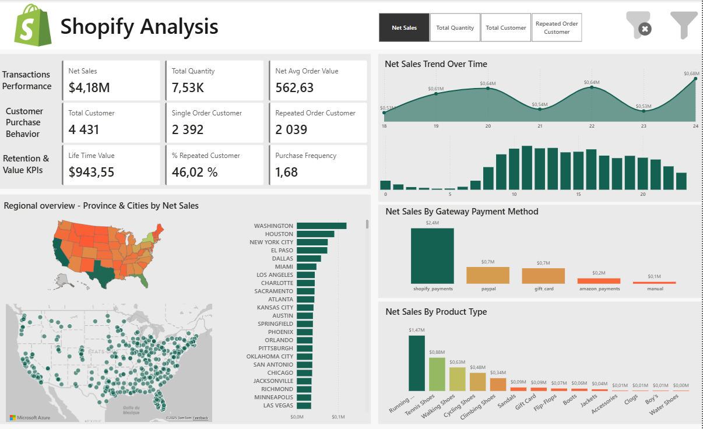
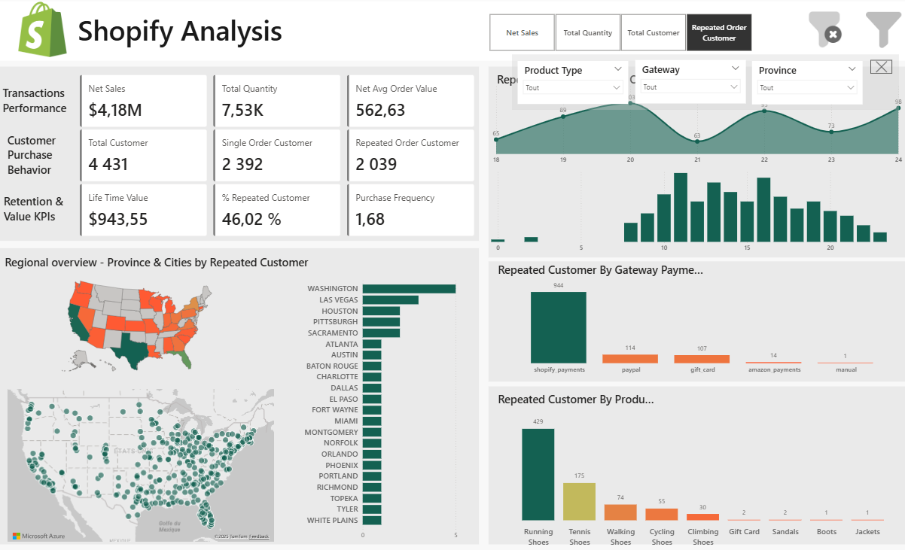
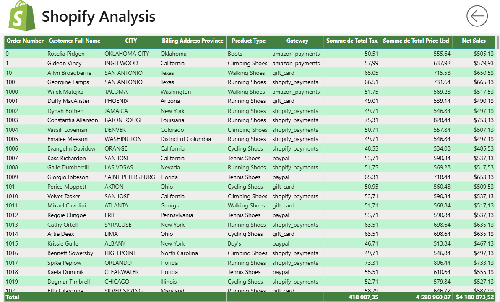

# Shopify Sales & Customer Analytics Dashboard

## Contexte du projet

Ce projet vise à analyser un extrait de données de ventes Shopify à travers un dashboard interactif Power BI, dans le but d’extraire des insights métiers sur la performance des transactions, le comportement d’achat des clients et la valeur client à long terme.

L’approche couvre l’ensemble du cycle de valorisation de la donnée : compréhension du besoin métier, préparation des données, modélisation, calcul d’indicateurs avancés (DAX) et data visualisation.

---

## Outils & Technologies

* **Power BI** : modélisation des données, DAX, visualisations interactives
* **Shopify Data** : données transactions, clients, produits, paiements
* **Git & GitHub** : versioning et documentation du projet

---

## Structure du projet

```
├── data/                # Données Shopify nettoyées
├── dashboard/           # Fichier Power BI (.pbix)
├── images/              # Captures d’écran du dashboard
├── documentation/       # Dictionnaire de données / terminologie
└── README.md            # Documentation du projet
```

---

## Aperçu du Dashboard





Cette vue synthétise les indicateurs clés de performance comme décrit ci-après :

### Vue globale – KPI principaux

* **Net Sales** (revenu hors taxes)
* **Total Quantity** (volume de produits vendus)
* **Net Average Order Value**
* **Total Customers**

### Performance des transactions

Analyse de la santé globale des ventes :

* Évolution du chiffre d’affaires
* Volume de commandes
* Valeur moyenne par commande

### Comportement d’achat des clients

Segmentation des clients selon leur comportement :

* **Single Order Customers**
* **Repeat Customers**
* Analyse de la fidélité et de l’engagement

### Fidélisation & valeur client

Indicateurs long terme :

* **Customer Lifetime Value (LTV)**
* **Repeat Rate**
* **Purchase Frequency**

### Analyse géographique

* Carte par **province** (color saturation dynamique) (qui sert aussi de filtre pour aller plus en details dans la carte comme les villes de cette province).
* Carte **ville** (bubble / density map)
* Classement des villes les plus performantes en fonction de la mesure choisie.

Les visualisations sont **dynamiques** grâce à un **sélecteur de mesure** :

* Net Sales
* Total Quantity
* Total Customers
* Repeat Customers

### Tendances temporelles

* Évolution **journalière** des indicateurs
* Analyse **horaire (0–23h)** pour identifier les pics d’activité

### Paiements & Produits

* Analyse des **moyens de paiement** (gateway)
* Performance par **type de produit**
* Identification des catégories générant le plus de valeur

---

### Vue détaillée & drill-through



Page dédiée à l’exploration **granulaire** des données :

* Transactions individuelles
* Clients
* Produits

---

## KPI analysés

### Performance des ventes

* Net Sales
* Total Quantity
* Net Average Order Value

### Comportement client

* Total Customers
* Single Order Customers
* Repeat Customers

### Fidélisation & valeur

* Customer Lifetime Value (LTV)
* Repeat Rate
* Purchase Frequency

---

## Insights clés

* Identification des zones géographiques les plus rentables
* Mise en évidence des comportements de clients fidèles
* Détection des créneaux horaires à fort potentiel
* Analyse des produits et moyens de paiement les plus performants


